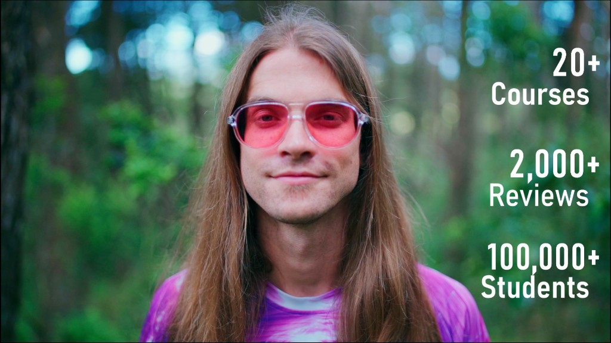

# Hi there 👋 I'm Douglas 

  

<h3 align="center"><b>
 <a href="https://in.aquarius.academy">👽 Teacher </a> ~ 
 <a href="https://open.spotify.com/playlist/2WEKrYq0mht0kyFguEcYzi">🎙 Rapper</a> ~ 
 <a href="https://www.redbubble.com/people/SirDouglasFresh/shop">🎨 Designer</a> ~ 
 <a href="https://gudasol.gumroad.com">🧙‍♂️ Visionary</a>
</b>
</h3>

--- 

# What I do: Empower People2 💫🙏 Design Futures

> My primary directives are to protect free will and expand human experience. I specialize in geometric forms that challenge beings to evolve past any limiting plane of existence. This manner of expression comes out in my ideas, music, code, art, and my work with trees.

___

### I give people tools to experience creations through empowering the creators, starting with [🔯 PURPLE on WAX](https://github.com/currentxchange/purple-explainer) and lately with [Tetra](https://know.tetra.earth/)

### I help people understand reality, offering a geometric model of [consciousness](https://aquarius.academy/learn/universal-consciousness-densities-dimensions-matrices-grids/)

## 👷‍♂️ I’m currently building: 🔺 [cXc](https://cxc.world) + ⨇ [Aquarius Academy](https://aquarius.academy/) + 🦾 [XParty](https://xparty.win) + ⨻ [Tetra](https://tetra.earth)

- ⛓👷‍♂️ Blockchain Architect + keyboard warrior behind [Ups](https://github.com/currentxchange/ups) | [Web4 Media Standards](https://github.com/currentxchange/WAX-NFT-Metadata-Standards) | [Loot - Gamified NFT Staking](https://github.com/currentxchange/loot) | [EASY reflective stable+ coin](https://aquariusacademy.notion.site/EASY-Liftoff-206ac693574b80e5aca2ddd57156b265)
- 🧙‍♂️🎇 Fashionista behind [🔮 Sir Douglas FRESH](https://www.redbubble.com/people/SirDouglasFresh/shop) | [Fresh Thread Shop](https://www.redbubble.com/people/FreshThreadShop/shop)
- 🎙 Voice behind [Gudasol]([https://open.spotify.com/playlist/2WEKrYq0mht0kyFguEcYzi](https://open.spotify.com/artist/4pRIUvglBRR8WYqBxXgbl9/discography)) | [Ammon the Wind](https://open.spotify.com/artist/2FfzRVuBtUAcAWPBx0mppG/discography/all) | [Ammon](https://open.spotify.com/artist/4seBsQrvamB7bbQ2UIftxU/discography/all) 
- 💫 Messanger behind 7-11 Model of Universal Consciousness [Youtube](https://www.youtube.com/watch?v=kk2RGJZXyvk&list=PLRRVgL5-YYRXx2wwGewdBxUl5Mr5--4u1&index=1) [Repo](https://github.com/dougbutner/universal-consciousness)

# 🌳 Forest of Linktrees

<h3 align="center"><b>
 <a href="https://linktr.ee/aquariusacademy"> ⨇ Aquarius Academy </a> ~ 
 <a href="https://linktr.ee/tetra.earth"> ⨻ Tetra </a> ~ 
 <a href="https://linktr.ee/cXc.world"> 🗺 cXc </a> ~ 
 <a href="https://linktr.ee/gudasol"> Gudasol 🜛 </a> 
</b>
</h3>

# 🏡 **[douglas.life](https://douglas.life/)** 

- 🌞 I’m keen to collaborate on cXc, Tetra, and Aquarius Academy
- 💬 Let's chat about: [Web 4](https://github.com/dougbutner/web-4), Geotemporal Systems, Biomimetic Economics, Fractal Information, Platonic Solids, Collective Participation Income (CPI), Time + Space Tokens, Channeling.
- ✈️ Get @ me: [discord@gudasol](https://discord.gg/MrRXZYhHfp) | [insta@gudasol_](https://instagram.com/gudasol) | [telegram@godsolislove](https://tg.me/godsolislove)

- 🌎 [Digital Nomad](https://gudasol.gumroad.com/l/become-digital-nomad) for over 6 years, mostly in Latin America. Currently in Lago de Atitlán, and based in Medellín, COL. From Maryland, USA

___   

## Grow among us 🤝
> We're seeking bright individuals to walk beside us in [Tetra](https://linktr.ee/tetra.earth)
 
<h1 align="center">
<a href="https://linktr.ee/gudasol">🔗🌳</a>
</h1>

___  
